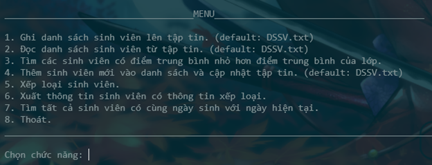
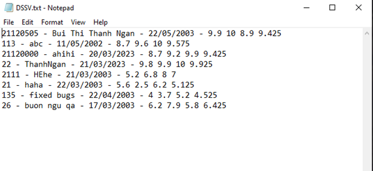
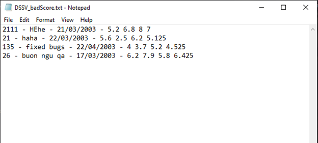
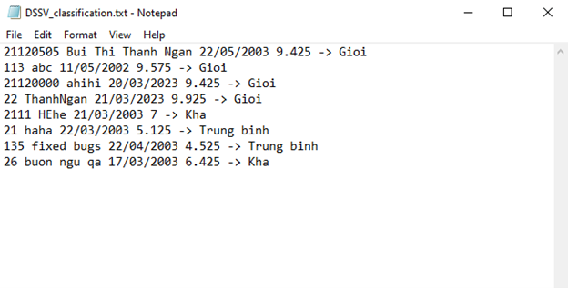
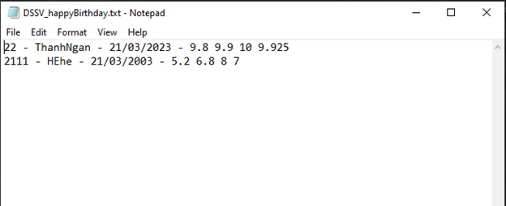

<div align="center" >
<h2 style="color:blue; font-weight:lighter">Báo cáo bài tập lớn tuần 2</h2>
</div>

<div style="height:100px"></div>
<!-- mục lục -->
<h3 style="color:blue; font-weight:lighter">Mục lục</h3>

- [1. Giao diện chương trình chính: menu](#giao-diện-chương-trình-chính)
- [2. Cài đặt lớp sinh viên](#cài-đặt-lớp-sinh-viên)
- [3. Xây dựng lớp quản lý sinh viên](#xây-dựng-lớp-quản-lý-sinh-viên)
    + [3.1 Ghi danh sách sinh viên lên tập tin](#ghi-danh-sách-sinh-viên-lên-tập-tin)
    + [3.2 Đọc danh sách sinh viên từ tập tin](#đọc-danh-sách-sinh-viên-từ-tập-tin)
    + [3.3 Thêm sinh viên mới và cập nhật tập tin](#thêm-sinh-viên-mới-và-cập-nhật-tập-tin)
    + [3.4 Tìm sinh viên có điểm trung bình nhỏ hơn điểm trung bình của lớp](#tìm-sinh-viên-có-điểm-trung-bình-nhỏ-hơn-điểm-trung-bình-của-lớp)
    + [3.5 Xếp loại sinh viên](#xếp-loại-sinh-viên)
    + [3.6 Tìm sinh viên có cùng ngày sinh nhật trong ngày hiện tại](#tìm-sinh-viên-có-cùng-ngày-sinh-nhật-trong-ngày-hiện-tại)
- [4. Cấu trúc thư mục mã nguồn ](#cấu-trúc-thư-mục-mã-nguồn)
- [5. Test cases](#test-cases)

<div style="height:500px"></div>
<h3 align="center" style = "color: #333; font-size: 16px; font-style: italic; font-weight:lighter " >Thành phố Hồ Chí Minh - Tháng 3/2023</h3>
<hr>

<!-- 1. Giao diện chương trình chính: menu -->
## Giao diện chương trình chính
<div align="center">

</div>


## Cài đặt lớp sinh viên
- Lớp SinhVien được cài đặt như sau:
```C++
class SinhVien {
    private: 
        char *_fullname;
        char *_id;
        char *_birthday;    // dd/mm/yyyy
        float *_marks;  // 3 điểm: BT, GK, CK _marks[0] = BT, _marks[1] = GK, _marks[2]= CK
        float _avg_mark;    // điểm trung bình

    public:
        // constructors
        SinhVien();     // default constructor
        SinhVien(char * , char * , char *, float* );

        // destructor
        ~SinhVien();

        // copy constructor
        SinhVien(const SinhVien& src);

        // assignment operator
        SinhVien& operator= (const SinhVien &);

        // setters
        void setName(char* );
        void setId(char* );
        void setBirthday(char* );
        void setMarks(float* );
        void setMark_BT(float );
        void setMark_GK(float );
        void setMark_CK(float );

        void calcAvg();

        // getters
        char* fullname();
        char* id();
        char* birthday();
        float* marks();
        float mark_BT();
        float mark_GK();
        float mark_CK();
        float avg_mark();

        // friend functions : nạp chồng nhập xuất 
        friend istream& operator>> (istream&, SinhVien& );
        friend ostream& operator<< (ostream&, SinhVien );
        friend ifstream& operator>> (ifstream&, SinhVien& ); 
        friend ofstream& operator<< (ofstream&, SinhVien);
};
```

- Hàm chuẩn hóa xâu ký tự cho các thuộc tính kiểu chuỗi của lớp SinhVien

```C++
void standardize(char *&s)
{
    if (s == NULL)
    {
        return;
    }
    int i = 0;
    while (s[i] == ' ') // remove những dấu cách thừa đầu chuỗi
    {
        i++;
    }
    strncpy(s, s + i, strlen(s) - i + 1);
    i = strlen(s) - 1;
    while (s[i] == ' ') // remove những dấu cách thừa cuối chuỗi
    {
        i--;
    }
    s[i + 1] = '\0';
}

```
- Cài đặt phương thức nạp chồng toán tử nhập từ bàn phím cho lớp SinhVien

```C++
istream &operator>>(istream &in, SinhVien &src)
{
    cout << "Enter the information of a student following this format: \nID - Fullname - Birthday(dd/mm/yy) - BT GK CK\n";

    // declare a buffer to store the input
    char *pos = new char[100];

    // ID
    in.getline(pos, 100, '-');  
    src.setId(pos);

    // Fullname
    in.getline(pos, 100, '-');
    src.setName(pos);

    // Birthday
    in.getline(pos, 100, '-');
    src.setBirthday(pos);

    // standardize the strings
    standardize(src._id);
    standardize(src._fullname);
    standardize(src._birthday);

    // check if the next character is a space
    while (in.peek() == ' ')
    {
        in.ignore();
    }

    // Marks
    src._marks = new float[3];  // allocate memory for the marks array

    // split marks from string input
    float score;    // store the score

    // BT score
    in.getline(pos, 100, ' ');
    score = atof(pos);
    src._marks[0] = score;

    // GK score
    in.getline(pos, 100, ' ');
    score = atof(pos);
    src._marks[1] = score;

    // CK score
    in.getline(pos, 100, '\n');
    score = atof(pos);
    src._marks[2] = score;

    delete pos;     // free the memory
    return in;
}
```
- Cài đặt phương thức nạp chồng toán tử nhập từ file cho lớp SinhVien: tương tự như phương thức nạp chồng toán tử nhập từ bàn phím chỉ khác là lúc này đọc từng dòng từ file và chèn vào stringstream để tách dữ liệu

```C++
ifstream &operator>>(ifstream &fin, SinhVien &src)
{
    // read a line from the file
    char *line = new char[200];
    fin.getline(line, 200, '\n');

    // insert line into a stringstream
    stringstream in(line);

    // declare a buffer to store the input
    char *pos = new char[100];

    // start to split the input
    // ID
    in.getline(pos, 100, '-');
    src.setId(pos);
    standardize(src._id);

    // Fullname
    in.getline(pos, 100, '-');
    src.setName(pos);
    standardize(src._fullname);

    // Birthday
    in.getline(pos, 100, '-');
    src.setBirthday(pos);
    standardize(src._birthday);

    // check if the next character is a space
    while (in.peek() == ' ')
    {
        in.ignore();
    }

    // Marks : BT GK CK AVG
    src._marks = new float[3];
    float score;

    // BT
    in.getline(pos, 100, ' ');
    score = atof(pos);
    src._marks[0] = score;

    // GK
    in.getline(pos, 100, ' ');
    score = atof(pos);
    src._marks[1] = score;

    // CK
    in.getline(pos, 100, ' ');
    score = atof(pos);
    src._marks[2] = score;

    // AVG
    in.getline(pos, 100, ' ');
    score = atof(pos);
    src._avg_mark = score;

    // free the memory
    delete pos;
    delete line;

    return fin;
}

```

- Cài đặt phương thức nạp chồng toán tử xuất:
- Thông tin xuất gồm cả `điểm TB` của sinh viên

```c++
ostream &operator<<(ostream &os, SinhVien src)
{
    // ID - Fullname - Birthday - BT GK CK - AVG
    os << src._id << " - " << src._fullname << " - " << src._birthday << " - " << src._marks[0] << " " << src._marks[1] << " " << src._marks[2] << " - " << src.avg_mark() << endl;

    return os;
}
```
```c++
ofstream &operator<<(ofstream &fout, SinhVien src)
{
    // ID - Fullname - Birthday - BT GK CK - AVG
    fout << src._id << " - " << src._fullname << " - " << src._birthday << " - " << src._marks[0] << " " << src._marks[1] << " " << src._marks[2] << " " << src.avg_mark() << endl;
    return fout;
}
```

## Xây dựng lớp quản lý sinh viên
- Quản lý danh sách sinh viên qua danh sách liên kết đơn có cấu trúc gồm các thành phần sau:
    - data: lưu trữ thông tin của sinh viên
    - next: con trỏ trỏ đến phần tử tiếp theo
    - classification: chuỗi lưu trữ xếp loại của sinh viên
```C++
struct Node   
{
    SinhVien data;
    Node *next;
    char *classification;

    Node () {   // default constructor
        next = NULL;
        classification = NULL;
    }

};

class QLSinhVien
{
private:
    Node *head; // con trỏ đầu danh sách
    int size;   // số lượng sinh viên
    float avgMarkClass; // điểm trung bình của lớp

    ifstream fin;   // input file stream
    ofstream fout;  // output file stream

public:
    // default constructor
    QLSinhVien();

    // destructor
    ~QLSinhVien();

    // methods
    // 3. viết hàm ghi danh sách sinh viên lên tập tin
    void write();

    // 4.  đọc danh sách sinh viên từ tập tin
    void read();

    // 5. tìm các sinh viên có đtb nhỏ hơn đtb của cả lớp, ghi dssv vào tập tin
    void find();

    // 6. thêm sv mới vào ds, cập nhật tập tin
    void add();

    // 7. xếp loại sinh viên
    void classify();

    // 8.  xuất thông tin sinh viên có thông tin xếp loại
    void output_classification();

    // 9. tìm tất cả sv có cùng ngày sinh trong ngày hiện tại
    void findSameBirthday();
};
```


## Ghi danh sách sinh viên lên tập tin
- Mặc định sẽ ghi vào file `DSSV.txt`
- Toán tử `<<` của đối tượng SinhVien đã được nạp chồng phía trên nên ta dễ dàng ghi thông tin sinh viên vào file như dưới đây
```c++
void QLSinhVien::write()
{
    if (head == NULL)
    {
        cout << "\nDon't have any student in list ...\n";
        return;
    }

    fout.open("DSSV.txt", ios::out);
    if (fout.fail())
    {
        cout << "\nCan't open file DSSV.txt..." << endl;
        return;
    }

    Node *temp = head;
    while (temp != NULL)
    {
        fout << temp->data; // ghi thông tin sinh viên vào file
        temp = temp->next;
    }

    fout.close();
}
```

## Đọc danh sách sinh viên từ tập tin
- Mặc định sẽ đọc từ file `DSSV.txt`
- Nếu `head` đã được lưu danh sách sinh viên trước đó thì ta sẽ giải phóng bộ nhớ và bắt đầu đọc dữ liệu, đọc đến khi `EOF`.
- Vừa đọc vừa lấy `điểm TB` của từng sinh viên cộng dồn lại và tính số lượng sinh viên `size` sau đó tính `điểm TB của cả lớp`.


```c++
void QLSinhVien::read()
{
    fin.open("DSSV.txt", ios::in);
    if (fin.fail())
    {
        cout << "Can't open file DSSV.txt ..." << endl;
        return;
    }
    if (head != NULL)
    {
        Node *temp = head;
        while (temp != NULL)
        {
            temp = head->next;
            delete head;
            head = temp;
        }
        if (size != 0)
        {
            size = 0;
        }
        if (avgMarkClass != 0)
        {
            avgMarkClass = 0;
        }
    }

    SinhVien temp;
    while (fin >> temp)
    {
        Node *pNode = new Node;
        pNode->data = temp;
        pNode->next = NULL;

        if (head == NULL)
        {
            head = pNode;
        }
        else
        {
            Node *tail = head;
            while (tail->next != NULL)
            {
                tail = tail->next;
            }
            tail->next = pNode;
        }
        avgMarkClass = avgMarkClass + pNode->data.avg_mark();
        size++;
    }
    // calculate avg score of class
    avgMarkClass = avgMarkClass / size;
    fin.close();
}
```

## Thêm sinh viên mới và cập nhật tập tin
```c++
void QLSinhVien::add()
{
    SinhVien sv;
    fflush(stdin);
    cin >> sv;  // toán tử nhập đã được nạp chồng phía trên
    sv.calcAvg();

    Node *pNode = new Node;
    pNode->data = sv;
    pNode->next = NULL;

    if (head == NULL)
    {
        head = pNode;
    }
    else
    {
        Node *temp = head;
        while (temp->next != NULL)
        {
            temp = temp->next;
        }
        temp->next = pNode;
    }
    size++;

    // update file
    fout.open("DSSV.txt", ios::app); // ios::app move to the end of file
    if (fout.fail())
    {
        cout << "Can't open file DSSV.txt\n";
        return;
    }
    fout << sv;
    fout.close();
}
```

## Tìm sinh viên có điểm trung bình nhỏ hơn điểm trung bình của lớp
- Dữ liệu được ghi ra file `DSSV_badScore.txt`.

```c++
void QLSinhVien::find()
{
    if (avgMarkClass == 0)
    { // trường hợp chưa tính đtb (nếu nhập từ bàn phím)
        Node *temp = head;
        while (temp->next != NULL)
        {
            avgMarkClass += temp->data.avg_mark();
        }
        avgMarkClass = avgMarkClass / size;
    }

    fout.open("DSSV_badScore.txt", ios::out);
    if (fout.fail())
    {
        cout << " Can't open DSSV_badScore.txt ...\n";
        return;
    }

    Node *temp = head;
    while (temp != NULL)
    {
        if (temp->data.avg_mark() < avgMarkClass)
        {
            fout << temp->data;
        }
        temp = temp->next;
    }
    fout.close();
}
```

## Xếp loại sinh viên

- Phân loại sinh viên thành :
+ `Giỏi` : `ĐTB >= 8`
+ `Khá` : `ĐTB < 8 && >= 6`
+ ` Trung bình` : `ĐTB < 6 `
```c++
void QLSinhVien::classify()
{
    Node *temp = head;
    while (temp != NULL)
    {
        temp->classification = new char[20];
        if (temp->data.avg_mark() >= 8)
        {
            strcpy(temp->classification, "Gioi\0");
        }
        else
        {
            if (temp->data.avg_mark() < 8 && temp->data.avg_mark() >= 6)
            {
                strcpy(temp->classification, "Kha\0");
            }
            else
            {
                strcpy(temp->classification, "Trung binh\0");
            }
        }
        temp = temp->next;
    }
}
```

## Tìm sinh viên có cùng ngày sinh nhật trong ngày hiện tại
- Mặc định xuất ra file `DSSV_happyBirthday.txt`.
- Lấy ngày hiện tại theo giờ địa phương.
- Ghi vào chuỗi dạng dd/mm để so sánh với ngày sinh của sinh viên.
```c++
void QLSinhVien::findSameBirthday()
{
    // get the present day
    time_t t = time(0); // get time now
    struct tm *now = localtime(&t);
    int d = now->tm_mday;  
    int m = now->tm_mon + 1;
    int y = now->tm_year + 1900;

    // convert dd/mm -> string
    char *presentDay = new char[50];
    if (d < 10)
    {
        sprintf(presentDay, "%c%d", '0', d);
    }
    else
    {
        sprintf(presentDay, "%d", d);
    }
    sprintf(presentDay + 2, "/");

    if (m < 10)
    {
        sprintf(presentDay + 3, "%c%d", '0', m);
    }
    else
    {
        sprintf(presentDay + 3, "%d", m);
    }

    fout.open("DSSV_happyBirthday.txt", ios::out);
    if (fout.fail())
    {
        cout << "Can't open file DSSV_happyBirthday.txt ...\n";
        return;
    }
    Node *temp = head;
    while (temp != NULL)
    {
        if (strncmp(temp->data.birthday(), presentDay, 5) == 0)
        {
            fout << temp->data;
        }
        temp = temp->next;
    }
    fout.close();
    delete presentDay;  // free memory
}
```

## Cấu trúc thư mục mã nguồn
<!-- <div align="center"> -->

- `main.cpp`
- `SinhVien.h`
- `QLSinhVien.h`
- `SinhVien.cpp`
- `QLSinhVien.cpp`

<!-- </div> -->

- Ngoài ra, có thể biên dịch và chạy chương trình nhanh bằng `Makefile` thông qua dòng lệnh `make main`, nó sẽ tạo ra các file object và file thực thi chương trình `main.exe`.
- Các files `input`, `output` và `Makefiles` được cập nhật nộp vào `week3`.


## Test cases
<div align="center">


<h4 style="color: green; font-weight: lighter; font-size:14px; text-align:center">Danh sách sinh viên</h4>


<h4 style="color: green; font-weight: lighter; font-size:14px; text-align:center">Danh sách sinh viên có điểm trung bình nhỏ hơn ĐTB cả lớp</h4>


<h4 style="color: green; font-weight: lighter; font-size:14px; text-align:center">Danh sách sinh viên có thông tin xếp loại</h4>


<h4 style="color: green; font-weight: lighter; font-size:14px; text-align:center">Danh sách sinh viên có ngày sinh nhật cùng ngày hiện tại</h4>

</div>

<hr>

